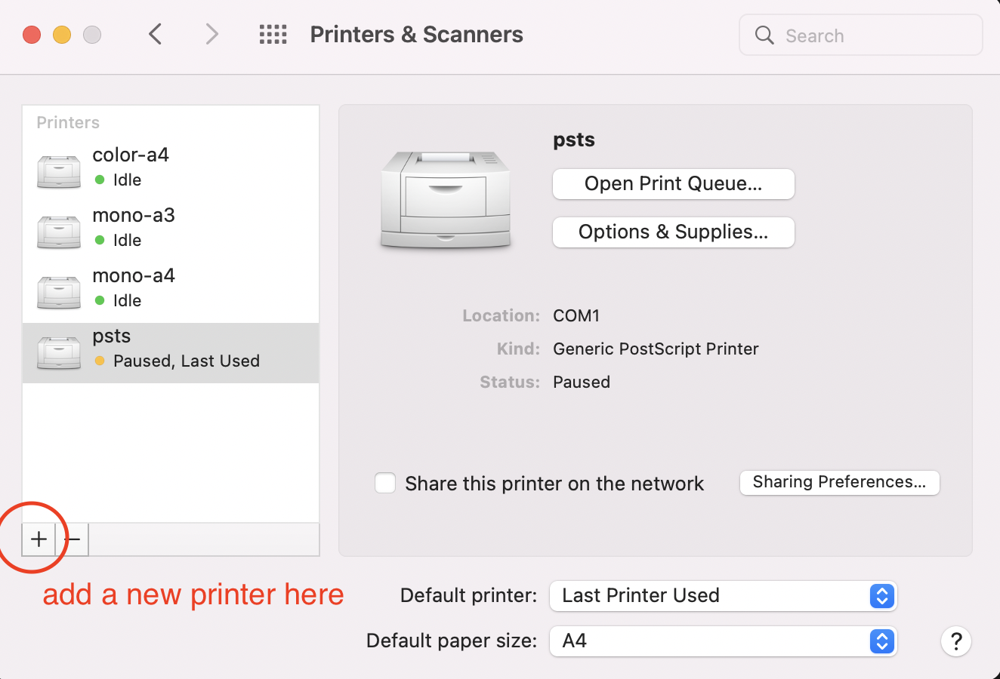
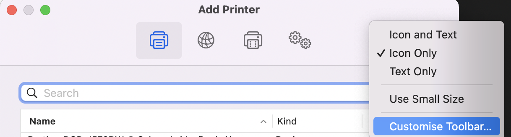
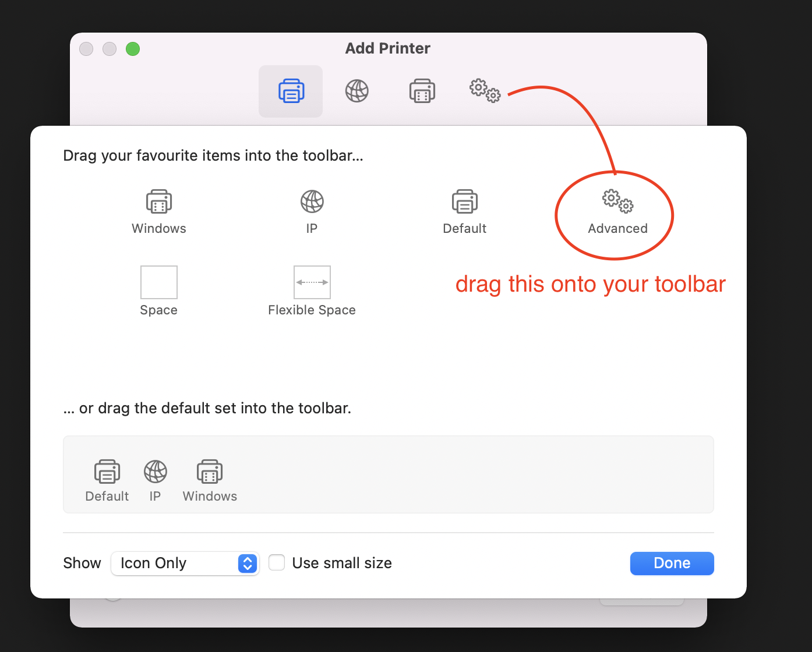
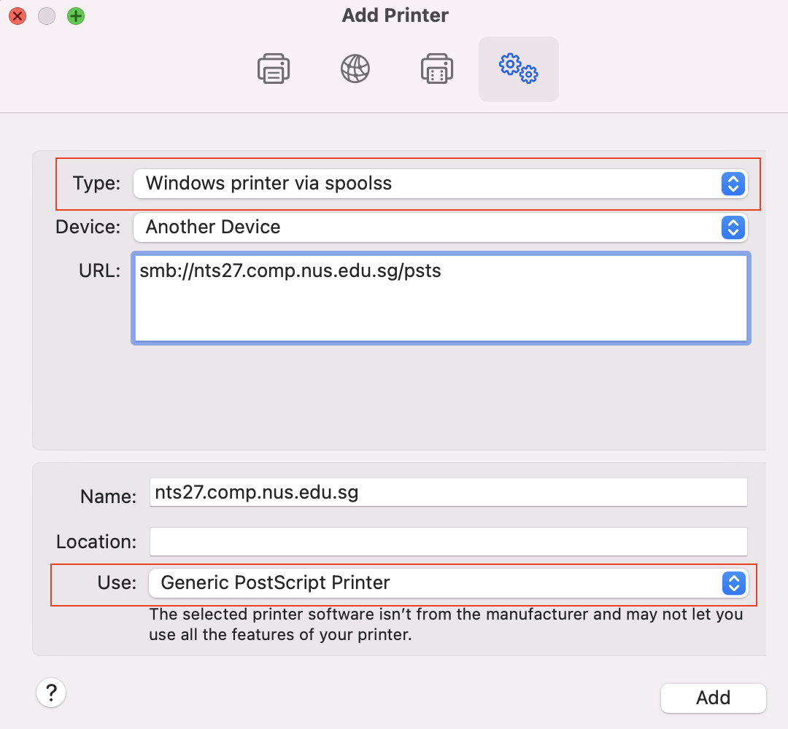

# SOC-printer-guide
I have consolidated the methods that worked for me. Hopefully it will help you too! 😊

## Method 1: Using MAC OS 

1. `cmd + spacebar` search for **Printers & Scanners**. 
2. Add a new printer. 

3. You might need to add the **Advanced** option if you do not see it. To do so:  
    1. Right click the top toolbar 
    2. Click customised toolbar 
        
        
    
    
    
    4. Drag the **Advanced** option into the toolbar  
    
    
    
    
    
4. Next, click **Advanced** and follow the options for `Type` and `Use` 
    
    
    

5. Look at the list below for printers available in COM1 and copy the printer URL that you want to use 
6. To complete the setup, choose a document to print and it will prompt you for your NUS Account details: 
    - user: NUSSTU\eXXXXXXX
    - password: NUSNET password

## COM1 Printers
#### Level 1
- smb://nts27.comp.nus.edu.sg/psts
- smb://nts27.comp.nus.edu.sg/pstsb
- smb://nts27.comp.nus.edu.sg/pstsc
### Basement 
- smb://nts27.comp.nus.edu.sg/psc008
- smb://nts27.comp.nus.edu.sg/psc011

## Important Note 
As we have to change our NUSNET password every now and then, it will cause a problem to the print authentication. To troubleshoot this, simply just delete the old password in the Apple Keychain and repeat the steps mentioned above to set it up again. Look out for the printer name to identify what to delete. 

## Method 2: Using SUNFIRE 
1. Login to sunfire. `ssh <account-name>@sunfire.comp.nus.edu.sg`
2. Transfer the file from your directory to Sunfire. `scp targetFile.pdf <account-name>6@sunfire.comp.nus.edu.sg:/home/e/<account-name/`
3. Convert PDF to PS file using the command `pdftops targetFile.pdf`. Note it will convert pdf to ps. 
4. Print command. `lpr -P <printerName> targetFile.ps` [pstsb, pstsb, pstsc]

